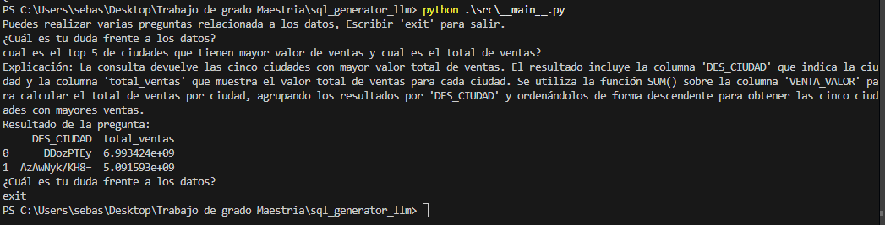
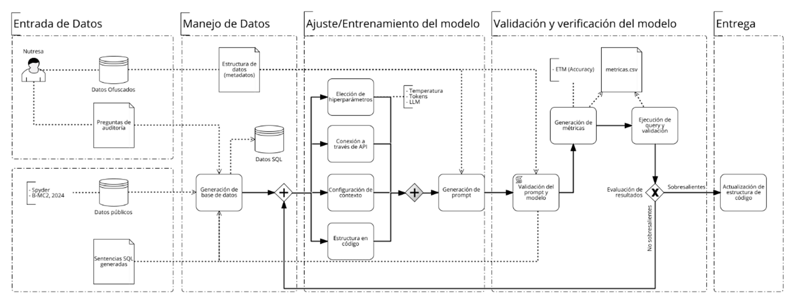

# Generador de SQL con Modelos de Lenguaje Natural
>Este documento presenta la descripción de la solución, la arquitectura y las principales consideraciones y pasos requeridos para realizar el despliegue e instalación del sistema de generación automática de consultas SQL a partir de preguntas en lenguaje natural.

También, en los siguientes enlaces se encuentra la información documental asociada al proyecto:

[Carpeta Asociada a Protocolo de Información de Equipo](**Se debe habilitar enlace de OneDrive en donde tenga la información**)

[Informe Proyecto](**Se debe habilitar enlace en donde tenga la información**)

[Manual de Usuario](**Se debe habilitar enlace en donde tenga la información**)

[Video Demo](**Se debe habilitar enlace en donde está el demo establecido**)

[Hacer copia y llenar plantilla de Comunicaciones](https://docs.google.com/document/d/1Lc-vkdru-VcBhAuCe9aKOgc99HhGIM9m/edit#heading=h.30j0zll)

## Tabla de Contenidos
* [Descripción de la solución](#descripción-de-la-solución)
* [Screenshots](#screenshots)
* [Arquitectura lógica de la solución](#arquitectura-lógica-de-la-solución)
* [Estructura del proyecto](#estructura-del-proyecto)
* [Requerimientos](#requerimientos)
* [Instalación](#instalación)
* [Configuración](#configuración)
* [Ejemplos de Uso](#ejemplos-de-uso)
* [Pruebas Automatizadas](#pruebas-automatizadas)
* [Autores](#autores)

## Descripción de la solución

### Reto del cliente
Las organizaciones enfrentan el desafío de permitir que usuarios no técnicos accedan a información almacenada en bases de datos mediante consultas complejas. Los analistas de negocio necesitan obtener insights de datos sin conocer SQL, lo que tradicionalmente requiere soporte técnico especializado y genera dependencias que ralentizan la toma de decisiones.

### Solución Alianza CAOBA
Esta solución implementa un sistema inteligente que convierte preguntas en lenguaje natural a consultas SQL optimizadas utilizando modelos de lenguaje de gran escala (LLM). El sistema soporta múltiples estrategias de generación de prompts (zero-shot, few-shot, y RAG) y es compatible con diferentes modelos como Gemini y ChatGPT.

**Características principales:**
- Generación automática de consultas SQL desde preguntas en español
- Soporte para múltiples motores SQL (pandas, ANSI)
- Implementación de RAG (Retrieval-Augmented Generation) para contexto mejorado
- Sistema de logging y monitoreo integrado
- Métricas de evaluación automática de la calidad de las consultas generadas

### Impacto potencial esperado en el Negocio
- **Democratización del acceso a datos**: Usuarios no técnicos pueden consultar información sin conocer SQL
- **Reducción de tiempos de respuesta**: Eliminación de cuellos de botella técnicos para consultas ad-hoc
- **Mejora en la toma de decisiones**: Acceso más rápido a insights basados en datos
- **Optimización de recursos**: Reducción de la carga de trabajo del equipo técnico
- **Escalabilidad**: Capacidad de manejar múltiples consultas simultáneas

### Screenshots / Demo


## Arquitectura lógica de la solución

El sistema implementa una arquitectura modular que integra modelos de lenguaje natural con procesamiento de datos estructurados:



**Componentes principales:**
1. **Interfaz de Usuario**: Recibe consultas en lenguaje natural
2. **Motor de Procesamiento de Prompts**: Genera prompts optimizados según la estrategia seleccionada
3. **Integración LLM**: Conecta con Gemini o ChatGPT para generar SQL
4. **Motor de Ejecución SQL**: Ejecuta consultas contra los datos usando pandas/SQL
5. **Sistema RAG**: Proporciona contexto relevante basado en embeddings
6. **Módulo de Evaluación**: Valida y mide la calidad de las consultas generadas

## Estructura del proyecto

```
.
├── README.md
├── requirements.txt
├── .gitignore
├── docker-compose.yml
├── Dockerfile
├── images/
│   ├── funcionamiento.png
│   └── flujo_datos.png
├── data/
│   ├── raw/
|   |   ├── Consultas Nutresa.xlsx
│   │   ├── data_micaja_ofuscada_20250214.csv
│   │   └── Definicion de campos_20250214.csv
│   ├── stage/
│   │   ├── rag_db_context.json
│   │   └── consultas_nutresa_resueltas.csv
│   └── analytics/
│       ├── Hugging_Face/
│       └── Nutresa/
├── src/
│   ├── __main__.py
│   ├── config/
│   │   ├── config_yaml_loader.py
│   │   └── config_example.yaml
│   ├── utils/
│   │   ├── data.py
│   │   └── models.py
│   ├── logs/
│   │   └── config_logging.py
│   └── test/
│       ├── test_hugging_face.py
│       ├── test_nutresa.py
│       ├── test_rag.py
│       ├── metricas_hugging_face.py
│       ├── metricas_nutresa.py
│       └── run_sql_nutresa.py
├── conf/
├── dashboard/
├── datalab/
├── deploy/
└── temp/
```


## Requerimientos

### Librerías Empleadas 
- **google-genai**: Integración con modelos Gemini de Google
- **openai**: Integración con modelos ChatGPT
- **pandas**: Manipulación y análisis de datos
- **pandasql**: Ejecución de consultas SQL en DataFrames
- **pyyaml**: Configuración mediante archivos YAML
- **networkx**: Análisis de estructuras de consultas SQL
- **sqlfluff**: Validación y formateo de consultas SQL
- **huggingface_hub**: Acceso a datasets de evaluación

### Requerimientos Hardware
- **Memoria RAM**: Mínimo 8GB, recomendado 16GB
- **Procesador**: CPU multi-core (4+ cores recomendado)
- **Almacenamiento**: 2GB de espacio libre mínimo
- **Conectividad**: Acceso a internet para APIs de LLM

### Requerimientos Software
- **Python**: 3.8 o superior
- **Sistema Operativo**: Windows 10+, macOS 10.14+, o Linux Ubuntu 18.04+
- **APIs requeridas**: 
  - Google Gemini API Key
  - OpenAI API Key (opcional)

## Instalación

1. **Clonar el repositorio**:
```bash
git clone <repository-url>
cd <project-directory>
```

2. **Crear ambiente virtual**:
```bash
python -m venv venv
source venv/bin/activate  # En Windows: venv\Scripts\activate
```

3. **Instalar dependencias**:
```bash
pip install -r requirements.txt
```

4. **Configurar variables de entorno**:
Copiar `src/config/config_example.yaml` como `src/config/config.yaml` y completar las API keys.

## Configuración

### Archivo de Configuración
Crear `src/config/config.yaml` basado en el ejemplo proporcionado:

```yaml
# Configuración general
llm_model: gemini  # gemini, chatgpt
prompt_method: few_shot  # zero_shot, few_shot, rag

# Configuración Gemini
gemini_api_key: YOUR_API_KEY
gemini_model: gemini-2.0-flash

# Configuración SQL
sql_motor: ansi
table_name: df

# Parámetros del modelo
temperature: 0.1
max_output_tokens: 512
top_p: 0.2
```

### Datos de Entrada
- Colocar archivo de datos en `data/raw/`
- Colocar definición de campos en `data/raw/`
- Para RAG, configurar `data/stage/rag_db_context.json`

## Ejemplos de Uso

### Uso Básico - Interfaz Interactiva
```bash
python src/__main__.py
```

### Ejemplos de Consultas
- "¿Cuál es el cliente que más vendió en agosto de 2024?"
- "¿Cuál es el top 5 de ciudades con mayor valor de ventas?"
- "¿Cuántas ventas se realizaron por mes en 2024?"

### Uso Programático
```python
from utils.models import send_prompt, get_sql_and_explanation
from utils.data import read_data_and_definition, query_data

# Cargar datos
df, context = read_data_and_definition(path_data, path_definition)

# Generar consulta
response = send_prompt("¿Cuántos registros hay en total?")
sql, explanation = get_sql_and_explanation(response)

# Ejecutar consulta
result = query_data(df, sql)
print(result)
```

## Pruebas Automatizadas

### Evaluación con Dataset Hugging Face
```bash
python src/test/test_hugging_face.py
python src/test/metricas_hugging_face.py
```

### Evaluación con Dataset Nutresa
```bash
python src/test/test_nutresa.py
python src/test/metricas_nutresa.py
```

### Pruebas RAG
```bash
python src/test/test_rag.py
```

### Métricas Implementadas
- **Exact Match**: Coincidencia exacta de resultados
- **Structural Match**: Coincidencia estructural de consultas
- **Value Accuracy**: Precisión en valores numéricos
- **ETM (Execution Tree Matching)**: Similitud en estructura de ejecución

## Errores conocidos

- **Rate Limiting**: Las APIs pueden limitar el número de consultas por minuto
- **Contexto Limitado**: Consultas muy complejas pueden exceder el límite de tokens
- **Precisión de Fechas**: Algunos formatos de fecha pueden requerir configuración adicional
- **Caracteres Especiales**: Algunos caracteres en nombres de columnas pueden causar errores

## Roadmap

- Implementación de base de datos vectorial
- Soporte para bases de datos relacionales directas
- Interfaz web para usuarios finales
- Métricas de rendimiento en tiempo real

## Autores

| Organización   | Nombre del Miembro | Rol | Correo electrónico | 
|----------|-------------|-------------|-------------|
| PUJ-Bogotá |  Sebastián Garzón Leitón: Estudiante maestría en analítica para la inteligencia de negocios | Desarrollo | sebastian_garzon@javeriana.edu.co |
| PUJ-Bogotá |  Laura Mariana Cubillos Toro: Estudiante maestría en analítica para la inteligencia de negocios | Desarrollo | cubillost_laura@javeriana.edu.co |
| PUJ-Bogotá |  Jonathan Claros Barbosa: Estudiante maestría en analítica para la inteligencia de negocios | Desarrollo | jonathan.claros@javeriana.edu.co |
| PUJ-Bogotá |  Hugo Alejandro Hernandez Rozo: Estudiante maestría en analítica para la inteligencia de negocios | Desarrollo | hugoa.hernandez@javeriana.edu.co |
| PUJ-Bogotá  |  Juan Pablo Pajaro Hernandez: Director trabajo de grado  | Director | juanpajaro@javeriana.edu.co |
| PUJ-Bogotá  |  Katherine Cabrera Rodriguez: Directora trabajo de grado  | Directora | katherine.cabrera@javeriana.edu.co |

## License

Este proyecto está bajo licencia [especificar licencia]. Ver el archivo LICENSE para más detalles.

## Support

Para soporte técnico o consultas sobre el proyecto:
- Crear un issue en el repositorio
- Contactar al equipo de desarrollo
- Revisar la documentación en [enlace a documentación]